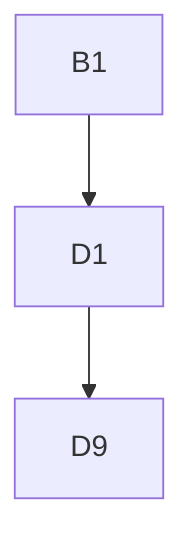

# Lab01 solutions

---
## Exercise 1 : Concepts of encapsulation, inheritance, and polymorphism

**N°1 :**

Encapsulation is the concept of hiding the implementation behind an interface, by bundling variables and functions together into units called classes. In java, everything is an object. To create a new object, we need to define a class, declare its attributes, make constructors to initialize the attributes, and write its methods.

**N°2 :**

1. accessor method (getter) : a method made to return a private attribute
2. mutator method (setter) : a method made to modify a private attribute

**N°3 :**

1. this : it allows us to access the attributes of the current class instance. It's used when we access an attribute that has the same name as an existing variable, e.g. x is a variable and this.x is the class attribute
2. super : used for inheritance. It's used in an inherited class constructor to initialize the parent class, and also during overridden methods to call the parent method with the same prototype.

**N°4 :**

Inheritance is the concept of making one or more child classes that have the same attributes and methods as their parent class, while extending their functionalities.

**N°5 :**

Polymorphism is the concept where any object can be treated as its parent type or its child type. It can be used to store many objects that inherit from the same class inside the same list.

Upcast : treating an object as if it was its parent type :
```java
Child o1 = Child();
Parent o2 = o1;
```

Downcast : treating an object as its child :
```java
Parent o1 = Parent();
Child o2 = (Child) o1;
```

When iterating on an array that contains multiple object types :
```java
For (Parent variable : listName) { }
```

**N°6 :**

Inheritance lets us extend classes into children, and polymorphism lets us bundle together different objects that share the same parent thanks to inheritance.

**N°8 :**

```java
package agh.ii.prinjava.lab01.lst01_03;

public class Test {
    public static void main(String[] args) {
        Circle cir = new Circle(5);
        double area = cir.area();
        System.out.println("Area :" + area);
    }
}
```

---
## Exercise 2 : Static members (variables/constants and methods)

**N°1 :**

Static variables are variables that belong to the class itself and not to the instances. They can be accessed and modified directly using the class name, and they share the same value across all instances.

Static constants are like static variables, but they can't be modified.

Static methods are also methods that can be used directly from the class. They can't use `this` since they don't belong to an instance, but they can use the class's static methods.

**N°2 :**

Static constants are often public because they are meant to be shared and accessed from the class.

**N°3 :**

Static methods don't have access to instance members because they belong to the class itself. They can't use instance attributes since these fields are different for every instance, and the same goes for non-static methods, since they may rely on instance attributes.

**N°4 :**

Static methods can be used to compare multiple instances of the same class.

---
## Exercise 3 : Constructors, factory methods, and singletons

**N°1 :**

Object initialisation is the moment a new instance is created, allocating resources for its variables and running the setup code.
When the program starts, all static field declarations and anonymous static blocks of every class are executed once, in the order they appear in the file, from top to bottom.
When an object is instantiated, its field declarations and anonymous blocks are run in the same way as the static ones, then the constructor that was called runs.
A value can be assigned to a declared field directly at declaration, in an anonymous block, or in the constructor. If the field is final, a value can only be assigned to it once per instance (or once per program run if it's also static).
If no value is assigned to a field, a default value is used : 0 for an int, false for a boolean, and null for an object reference.

**N°2 :**

D9 class inheritance diagram :


Sequence of constructor calls :
```
B1.B1()
D1.D1()

B3.B3(int)
D7.D7(int)
D7.D7()

B3.B3(int)
D4.D4()

D9.D9()

B1.B1()
D1.D1()
```
When D9 is created, java first initializes the parent class before running its own declarations, anonymous blocks, and constructor body.

**N°3 :**

Constructors have the same name as their class and are called when the object is instantiated. A class can have several overloaded constructors, and a constructor can call another one.
Factory methods are static methods that act as constructors under a different name. A class can have several factory methods, either overloaded or with different names. A factory method can return either a new instance or an already existing one, and can also do extra work before returning it.

**N°4 :**

The singleton pattern is used to have a class with a unique instance and a unique access point to it.

---
## Exercise 4 : Immutable objects/classes and Java Records

**N°1 :**

We can make immutable objects by declaring every field as private and not writing any method that modifies these fields.

**N°2 :**

An immutable object is an object whose field values can't be modified, while an immutable class is a class whose fields and methods can't be overridden.

**N°3 :**

The advantage of immutable objects is that they can be shared and passed as parameters without worrying that a method might modify their content.

**N°4 :**

Java records can be used to significantly reduce the amount of code in a class that only holds data. They are a simple way to create read-only immutable data structures.

---
## Exercise 5 : Overriding hashCode, equals, and toString

**N°1 :**

The `==` operator only compares object references, while the equals() method can be used to define a class-specific comparison behavior.

**N°2 :**

This formula means that when comparing object o1 with object o2 using .equals(), the code checks their hash codes to see if they have the same field content.
